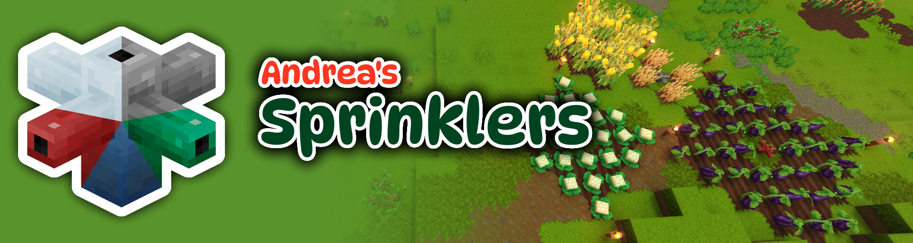

# Andrea's Sprinklers

This mod adds simple sprinklers for Hytale, to automatically water your tilled soil. From iron to mithril, each variant will have their own range.

> **⚠️ Warning: Early Access**
> The game Hytale is in early access, and so is this project! Features may be
> incomplete, unstable, or change frequently. Please be patient and understanding as development
> continues.

## Features

You can craft them at the Farmer's Workbench, after upgrading it to at least tier 5. Each variant will water tilled soil within a specified range in a diamond pattern (also called "taxicab/manhattan distance").

The folloWing variants are available:

* Iron: Tier 5, Range 1
* Thorium: Tier 6, Range 2
* Cobalt: Tier 7, Range 3
* Adamantite: Tier 8, Range 4
* Mithril: Tier 10, Range 8

## Upcoming

The following things are on my To-Do list, which will get adressed. Suggestions welcome!

* [ ] Add animations and effects when watering
* [ ] Optimize code to make it not run every tick, but every "watering cycle" (currently configured to 24 ingame hours for the soil itself). This would make it more server-load friendly, but stop "insta-responding" to newly tilled soil. An interaction would be added for this
* [ ] An extra tab in the Farmer's Workbench for sprinklers, if feasible. If not maybe a new workbench for sprinklers? We'll see...
* [ ] Variants that emit light. Either as extra item or by right-clicking a sprinkler with a light source (torches)
* [ ] Variants that auto-till soil. Either as extra item or by right-clicking a sprinkler with a hoe
* [ ] (Maybe) Letting you "spread" seeds when right-clicking the sprinkler with seed bags in your hand